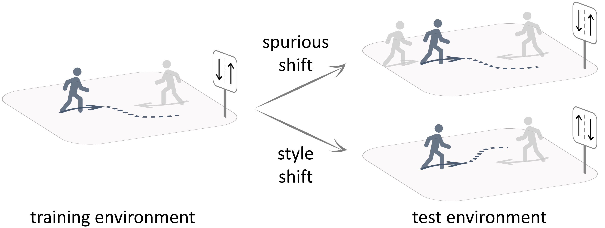
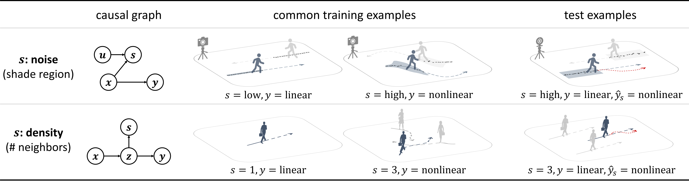
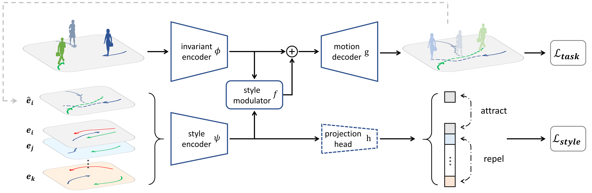

# Causal Motion Representations

**[`Paper`](https://arxiv.org/abs/2111.14820) | [`Video`](https://youtu.be/mqx988tyhfc) | [`Adaptive Y-net`](https://github.com/sherwinbahmani/ynet_adaptive)**

<p align="center">
  
</p>

This is an official implementation for the paper

**Towards Robust and Adaptive Motion Forecasting: A Causal Representation Perspective**
<br>
*IEEE Conference on Computer Vision and Pattern Recognition (CVPR), 2022.*
<br>
<a href="https://sites.google.com/view/yuejiangliu">Yuejiang Liu</a>,
<a href="https://www.riccardocadei.com">Riccardo Cadei</a>,
<a href="https://people.epfl.ch/jonas.schweizer/?lang=en">Jonas Schweizer</a>,
<a href="https://www.linkedin.com/in/sherwin-bahmani-a2b5691a9">Sherwin Bahmani</a>,
<a href="https://people.epfl.ch/alexandre.alahi/?lang=en/">Alexandre Alahi</a>
<br>
École Polytechnique Fédérale de Lausanne (EPFL)

TL;DR: incorporate causal *invariance* and *structure* into the design and training of motion forecasting models to improve the *robustness* and *reusability* of the learned representations under common distribution shifts
* causal formalism of motion forecasting with three groups of latent variables
* causal (invariant) representations to suppress spurious features and promote robust generalization
* causal (modular) structure to approximate a sparse causal graph and facilitate efficient adaptation

### Spurious Shifts

In the context of motion forecasting, the target trajectory is often correlated with some spurious features, such as observation noises and agent densities. Yet, such correlations are brittle and lead to poor robustness under spurious shifts. We simulate this effect in a controlled setting and demonstrate that models trained to perform equally well across training environments tend to suppress spurious features and generalize better.

<p align="center">
  
</p>

Please check out the code in the [spurious](spurious) folder.

### Style Shifts

One unique property of motion problems is that behavioral styles may naturally vary from one environment to another. To explicitly model this, we design a modular architecture that factorizes the representations of invariant features and style confounders. We train the style encoder with a contrastive loss, which allows for effective use of the structured knowledge during both training and deployment.

<p align="center">
  
</p>

Please check out the code in the [style](style) folder.

### Citation

```bibtex
@InProceedings{Liu2022CausalMotionRepresentations,
    title     = {Towards Robust and Adaptive Motion Forecasting: A Causal Representation Perspective},
    author    = {Liu, Yuejiang and Cadei, Riccardo and Schweizer, Jonas and Bahmani, Sherwin and Alahi, Alexandre},
    booktitle = {Proceedings of the IEEE/CVF Conference on Computer Vision and Pattern Recognition (CVPR)},
    month     = {June},
    year      = {2022},
    pages     = {17081-17092}
}
```

### Developers

Our code is mainly developed by [Riccardo Cadei](https://www.riccardocadei.com) and [Jonas Schweizer](https://people.epfl.ch/jonas.schweizer/?lang=en).

### Acknowledgements

Our code is built upon the public code of the following papers:
* [Human Trajectory Prediction via Counterfactual Analysis, ICCV'21](https://github.com/CHENGY12/CausalHTP)
* [It Is Not the Journey but the Destination: Endpoint Conditioned Trajectory Prediction, ECCV'20](https://github.com/HarshayuGirase/Human-Path-Prediction)
* [STGAT: Modeling Spatial-Temporal Interactions for Human Trajectory Prediction, ICCV'19](https://github.com/huang-xx/STGAT)
