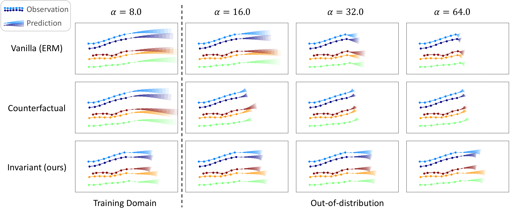

## Spurious Shifts

Robustness of motion forecasting models under spurious shifts

### Requirements

```
pip install --upgrade pip
pip install -r requirements.txt
pip3 install torch==1.9.0+cu111 -f https://download.pytorch.org/whl/torch_stable.html 		
```

---

### Training

Train [STGAT](https://openaccess.thecvf.com/content_ICCV_2019/papers/Huang_STGAT_Modeling_Spatial-Temporal_Interactions_for_Human_Trajectory_Prediction_ICCV_2019_paper.pdf) with different methods:
* Empirical Risk Minimization (ERM)
* [Counterfactual Analysis](https://openaccess.thecvf.com/content/ICCV2021/papers/Chen_Human_Trajectory_Prediction_via_Counterfactual_Analysis_ICCV_2021_paper.pdf)
* [Invariant Risk Minimization](https://arxiv.org/pdf/1907.02893.pdf;) (IRM)
* (NEW) [Variance Risk Extrapolation](http://proceedings.mlr.press/v139/krueger21a/krueger21a.pdf) (v-REx)

On baseline 'ETH-UCY' dataset:
```
bash scripts/baseline/train.sh
```
On modified 'ETH-UCY' dataset adding a controlled spurious feature:
```
bash scripts/add_confidence/train.sh
```

- Change the variable `dataset_name` expressing the environment you want to use for testing. All the other environments are used for training. 

Pretrained models from all the methods on baseline 'ETH-UCY' dataset (environment: `hotel`) already saved in `/models/hotel`. \
Pretrained models from all the methods on modified 'ETH-UCY' dataset (environment: `eth`) already saved in `/models/eth`.

---

### Evaluation

Evaluate the trained models on baseline 'ETH-UCY' dataset:
```
bash scripts/baseline/evaluate.sh
```
Evaluate the trained models on modified 'ETH-UCY' dataset under various spurious shifts:
```
bash scripts/add_confidence/evaluate.sh
```

- Change the variable `model_name` expressing the model you want to evaluate
- Change the variable `metrics` expressing the type of evaluation that you want to run:
    - `quantitative`: compute the Average Displacement Error (ADE) and Final Displacement Error (FDE)
    - `qualitative`: visualize a scene
    - (SOON AVAILABLE) `collisions`: compute the number of collisions


Save all the quantitative results in a CSV file and plot the results (only per experiments on modified 'ETH-UCY').
```
bash scripts/extract.sh
```
- Change the variable `DATASET` expressing the dataset you want to extract the results from.
---

### Results

#### On baseline 'ETH-UCY' dataset

| Method  | Vanilla (ERM) | Counterfactual | Invariant (ours) |
|---------|---------------|----------------|------------------|
| ADE (↓) | 0.536 ±0.015  | 0.512 ±0.057   | **0.457** ±0.054     |
| FDE (↓) | 1.088 ±0.039  | 1.029 ±0.136   | **0.918** ±0.098     |

Comparison of different methods on the original ETH-UCY dataset. The STGAT trained by our invariant approach substantially outperforms the vanilla ERM and the counterfactual counterparts. 

#### On baseline 'ETH-UCY' dataset adding a controlled spurious feature

- **Quantitative**

  

Comparison of different methods on the ETH-UCY dataset with controlled spurious correlations. Our invariant learning approach substantially outperforms the conventional ERM and the counterfactual approach in the out-of-distribution regime α in (8,64], while being on par within the training domains.


- **Qualitative**



Visualization of the predicted trajectories from different methods in a particular test case of the ETH-UCY dataset with controlled spurious features.
Despite the same past trajectory observation and ground truth future, the predicted trajectories from the two baselines abruptly slow down, when the strength of the spurious feature at test time is larger than that in the training domains. 
In comparison, our invariant learning approach results in much more robust solutions, even under substantial spurious shifts (e.g., α=64).


