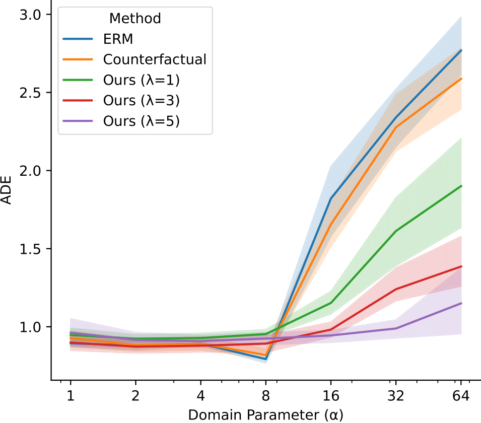
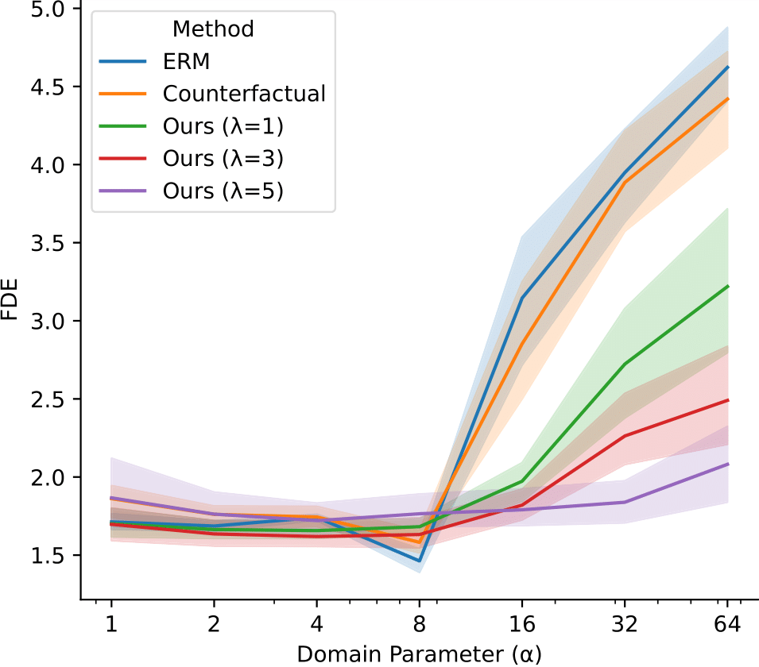

## Spurious Shifts

Robustness of motion forecasting models under spurious shifts

### Requirements

```
pip install --upgrade pip
pip install -r requirements.txt
pip3 install torch==1.9.0+cu111 -f https://download.pytorch.org/whl/torch_stable.html 		
```

---

### Training

Train STGAT with different methods:
* Empirical Risk Minimization (ERM)
* Counterfactual Analysis
* Invariant Risk Minimization (IRM)
* (NEW) Variance Risk Extrapolation (v-REx)

On baseline 'ETH-UCY' dataset:
```
bash scripts/baseline/train.sh
```
On modified 'ETH-UCY' dataset adding a controlled spurious feature:
```
bash scripts/add_confidence/train.sh
```

- Change the variable `dataset_name` expressing the environment you want to use for testing. All the other environments are used for training. 

Pretrained models from all the methods on baseline 'ETH-UCY' dataset (environment: `eth`) already saved in `/models/eth`. \
Pretrained models from all the methods on modified 'ETH-UCY' dataset (environment: `hotel`) already saved in `/models/hotel`.

---

### Evaluation
Evaluate the trained models under various spurious shifts

On baseline 'ETH-UCY' dataset:
```
bash scripts/baseline/evaluate.sh
```
On modified 'ETH-UCY' dataset adding a controlled spurious feature:
```
bash scripts/add_confidence/evaluate.sh
```

- Change the variable `model_name` expressing the model you want to evaluate
- Change the variable `metrics` expressing the type of evaluation that you want to run:
    - `quantitative`: compute the Average Displacement Error (ADE) and Final Displacement Error (FDE)
    - `qualitative`: visualize a scene
    - (SOON AVAILABLE) `collisions`: compute the number of collisions


Save all the quantitative results in a CSV file.
```
bash scripts/extract.sh
```

---

### Basic Results

Results of different methods under spurious shifts.

  

