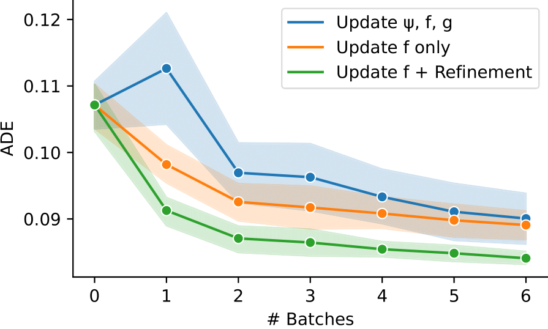
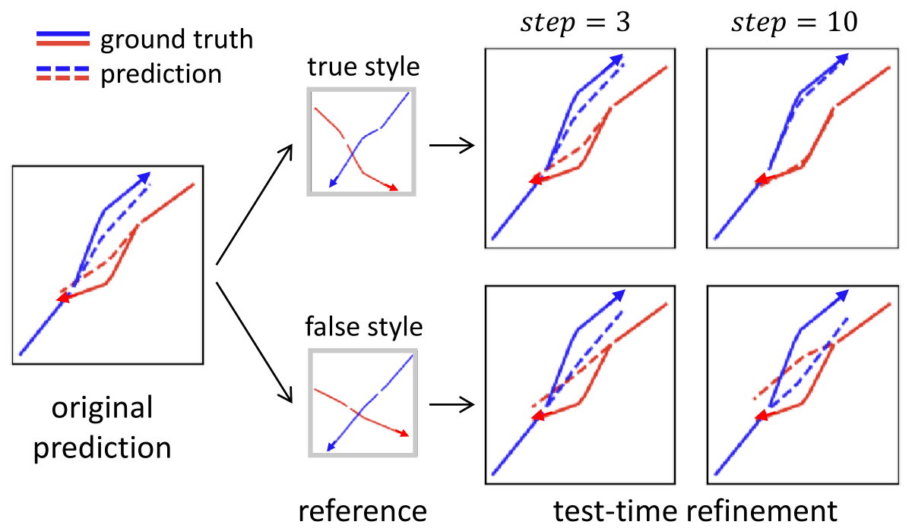

## Style Shifts

Robustness and adaptability of motion forecasting models under style shifts

--- 

### Requirements

```
pip install --upgrade pip
pip install -r requirements.txt
pip3 install torch==1.9.0+cu111 -f https://download.pytorch.org/whl/torch_stable.html
```

---

### Dataset

Synthetic data (`v4`) generated by ORCA can be downloaded [here](https://drive.google.com/file/d/1OQfZ1Y8XkFhZY8NE_TsSiDwwcvjCIECa/view?usp=sharingare), and need to be saved in `/datasets/`. 

--- 

### Training

Train baseline or our modular architecture.
```
bash scripts/train.sh
```

Pretrained models on dataset `v4` for all the methods with seed=1,2,3,4,5 are already saved in `/models/v4/pretrain/`.

### Zero-shot Generalization

Evaluate pretrained models on different domains, including both in-distribution and out-of-distribution settings.
```
bash scripts/evaluate_generalization.sh
```
Save all the quantitative results in `results/{dataset_name}/pretrain/summary.csv`.
```
bash scripts/extract_generalization.sh
```

--- 

### Low-shot Adaptation

Adapt pre-trained model to new domains in the low-shot setting.
```
bash scripts/finetune.sh
```

Finetuned models on dataset `v4` for all the methods with seed=1,2,3,4,5 are already saved in `/models/v4/finetune/`.

Evaluate finetuned model.
```
bash scripts/evaluate_adaptation.sh
```

Save all the quantitative results in `results/{dataset_name}/finetune/summary.csv`.
```
bash scripts/extract_adaptation.sh
```

---


### Refinement
Test-time refinement of the predictions on the fly. Instead of simply evaluating the ADE of the predictions, we optimize the latent space to make the prediction's style more similar to the style of the env (using contrastive loss)
```
bash scripts/refine.sh
```

We can either enforce the prediction to follow more the style of the env, or to make the prediction follow another style (with `--wrongstyle true`). The number of steps can be specified with `--ttr` parameter. 

--- 

### Basic Results

- **Out of Distribution Generalization**

| Method              | IID          | OoD-Inter    | OoD-Extra    |
|---------------------|--------------|--------------|--------------|
| Vanilla (ERM)       | 0.113 ±0.004 | 0.112 ±0.003 | 0.192 ±0.013 |
| Invariant (ours)    | 0.115 ±0.005 | 0.114 ±0.004 | 0.191 ±0.007 |
| Modular (ours)      | 0.063 ±0.005 | 0.070 ±0.006 | 0.112 ±0.004 |
| Inv + Mod (ours)    | 0.065 ±0.007 | 0.069 ±0.007 | 0.107 ±0.007 |

Quantitative comparison of different methods under style shifts. 
Models are evaluated by ADE (lower is better) over 5 seeds. 
Both the vanilla baseline and our invariant approach alone suffer from large errors, since they either average the domain-varying styles or ignore them. 
Our modular network incorporates distinctive style features into prediction and hence yields much better results.
In particular, enforcing the causal invariance of the first encoder ψ leads to the best OoD robustness, while being highly competitive in the training environments.

- **Low-Shot Transfer**



Quantitative results of different methods for transfer learning to a new motion style, given limited batch of samples.
Our modular adaptation strategy (updating the style modulator _f_ yields higher sample efficiency than the conventional counterpart in the low-data regime.
Moreover, refining the predicted output for 3 iterations further reduces the prediction error on the fly.

- **Test-Time Refinement**
  

  
Qualitative effects of test-time refinement in a two-agent scenario. 
The initial predicted output suffers from a clear prediction error.
Given a scene observation of the true style (large separation distance) as a reference, our method gradually closes the discrepancy between the predicted trajectory and the ground truth.
Conversely, when conditioned on a scene of a different style (small separation distance) as the reference, our method manages to steer the output towards the corresponding false style as well.


